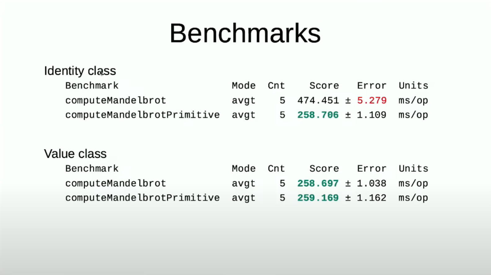
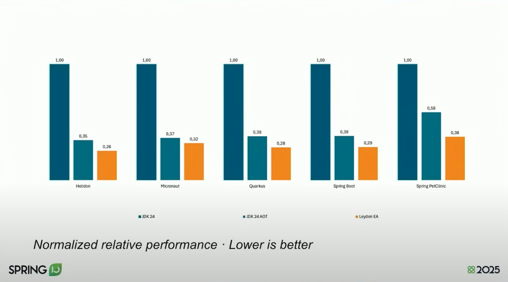
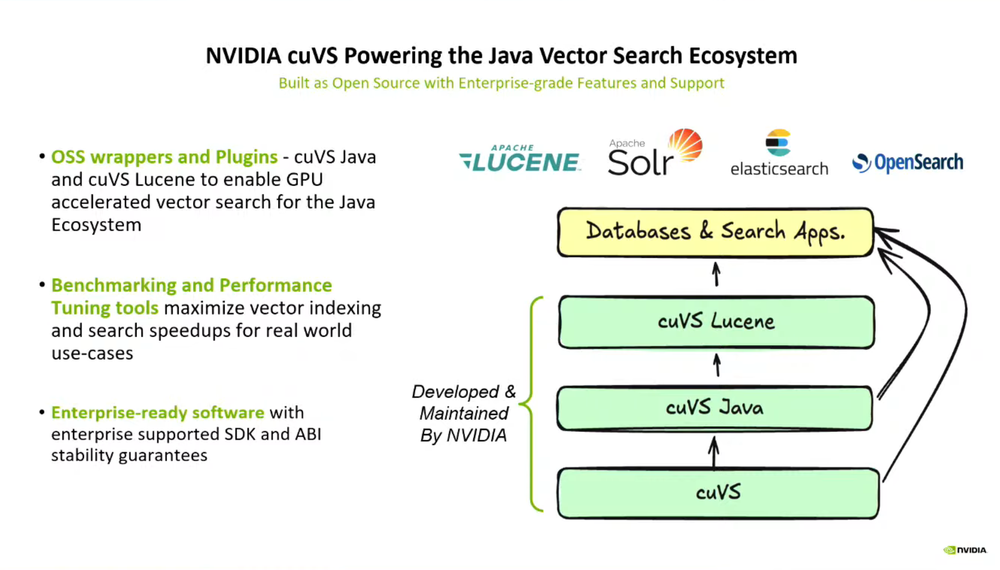
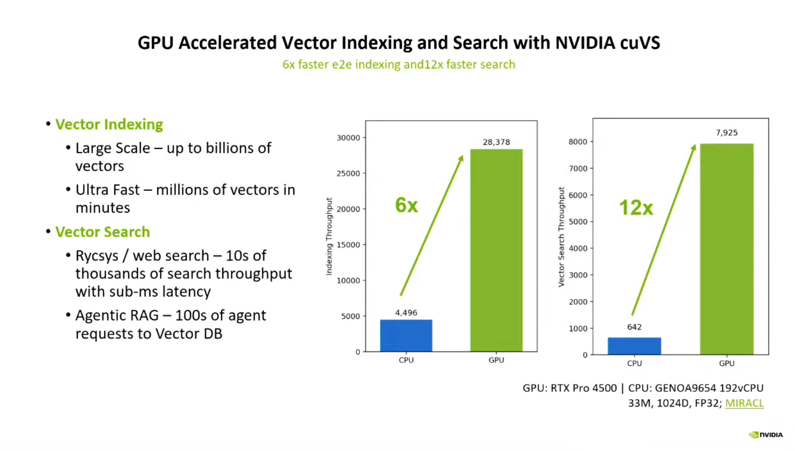
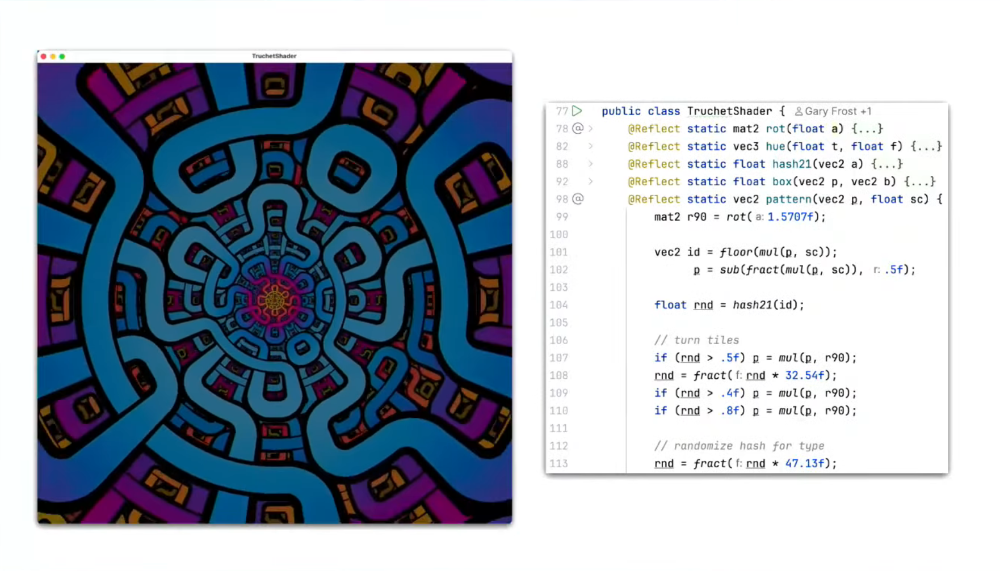

# Java 25 - 26 újdonságok, Spring újdonságok

Merre tart a Java és a Spring 2026-ban?

A Java továbbra is megállíthatatlanul fejlődik, 2026 márciusában kijött a Java 26. Idén már megtartották a két legfontosabb konferenciát, márciusban a JavaOne, áprilisban a Spring IO. Nézzük, merre tart a fejlődés, milyen újdonságokkal készültek a platform meghatározó szakemberei.

## Emlékeztető

* 2025. 06. 26. - Java 23 - 24 újdonságok
* 2025. 07. 17. - Jakarta, Spring Framework 7, Spring Boot 4 újdonságok

## Inspiráció

* JavaOne 2026 konferencia [Keynote](https://www.youtube.com/watch?v=3fLCOqpIfI0&t=8354s)

## Java SE - Fejlesztési területek

* [Fél évente új verzió](https://en.wikipedia.org/wiki/Java_version_history)
* Legfrissebb: Java 26 - 2026. március
* Tanulhatóság
* Fejlesztői kényelem
* Performancia (processzorok, cloud, IoT): throughput, scale, performance
* AI

## Issues fixed


Forrás: JavaOne 2026

## Tanulhatóság

```java
void main() {
    String name = IO.readln("Name: ");
    IO.println("Hello, " + name);
}
```

(Scriptelhetőség)

Project Amber: productivity-oriented Java language features

(JEPs)

* JEP 222: jshell: The Java Shell (Read-Eval-Print Loop) - Java 9
* JEP 330: Launch Single-File Source-Code Programs - Java 11
* JEP 458: Launch Multi-File Source-Code Programs - Java 22
* JEP 511: Module Import Declarations - Java 25
* JEP 512: Compact Source Files and Instance Main Methods - Java 25


## Tanulhatóság Oracle támogatással

* Oracle - [learn.java](https://learn.java/)
* Oracle - [Java Platform Extension for Visual Studio Code](https://github.com/oracle/javavscode): Interactive Java Notebooks, stb.
    * Java Verified Portfolio része (JavaFX és Helidon mellett)


## Data Oriented Programming

* OOP gyakran komplex lesz
* Data Oriented Programming alapelvek:
    * Principle #1 - Separate code from data
    * Principle #2 - Represent data entities with generic data structures
    * Principle #3 - Data is immutable
* Különböző nyelvi elemek, külön-külön is erősek, de egyben még erősebbek

(JEPs)

* JEP 361: Switch Expressions (Standard) - Java 14
* JEP 409: Sealed Classes - Java 17
* JEP 440: Record Patterns - Java 21
* JEP 441: Pattern Matching for switch - Java 21
* JEP 456: Unnamed Variables & Patterns - Java 22


## Data Oriented Programming példa

```java
public abstract sealed class Shape
    permits Circle, Rectangle, Triangle {...}
```

```java
public Point getCenter(Shape shape) {
    return switch (shape) {
        case Circle(Point center, double _) -> new Point(center.x, center.y);
        case Rectangle(Point topLeft, Point bottomRight) ->
            new Point(
                (topLeft.x + bottomRight.x) / 2,
                (topLeft.y + bottomRight.y) / 2
            );
        case Triangle(Point p1, Point p2, Point p3) ->
            new Point(
                (p1.x + p2.x + p3.x) / 3,
                (p1.y + p2.y + p3.y) / 3
            );
    };
}
```

vs. template method design pattern


## Stream Gatherers

- Saját intermediate operation
- Előre megírt implementációk a `Gatherers` osztályban

```java
var windows = IntStream.range(0, 10)
                .boxed()
                .gather(Gatherers.windowFixed(3))
                .toList(); // [[0, 1, 2], [3, 4, 5], [6, 7, 8], [9]]
```

(JEPs)

* JEP 485: Stream Gatherers - Java 24


## Constructor bodies

```java
class Employee extends Person {

    String officeID;

    Employee(..., int age, String officeID) {
        if (age < 18  || age > 67)
            // Now fails fast!
            throw new IllegalArgumentException(...);
        this.officeID = officeID;   // Initialize before calling superclass constructor!
        super(..., age);
    }

}
```

(JEPs)

* JEP 513: Flexible Constructor Bodies - Java 25


## JavaDoc

(JEPs)

- JEP 467: Markdown Documentation Comments - Java 23
- [Java 26 API Documentation](https://docs.oracle.com/en/java/javase/26/docs/api/index.html) - Dark Mode - Java 26


## Concurrency

* Java (Thread), 5 (Executors), 8 (`CompletableFuture`, parallel streams)
* Project Loom
    * Virtual Threads
    * Scoped Values
    * Structured Concurrency: egyszerűbb, hibamentesebb, erőforráskímélőbb párhuzamosság, ha az `X` szál indít egy `Y` szálat, akkor az `Y` nem futhat tovább, mint az `X`

(JEPs)

- JEP 444: Virtual Threads - Java 21
- JEP 491: Synchronize Virtual Threads without Pinning - Java 24
- JEP 506: Scoped Values - Java 25
- JEP 525: Structured Concurrency (Sixth Preview) - Java 26


## Virtual threads

* Virtual threads
  * JVM által (és nem az OS által) vezérelt szálak
  * Nem költséges, akár több millió is létrehozható, nem kell poolozni
  * Leképezhető platform szálra, carrier threads
  * IO-ra várás (fájl, hálózat) az OS szálakkal ellentétben nem erőforrásigényes
  * Performancia szempontjából kiválthatják a reaktív programozást
* Pinning: virtuális szál nem tud leválni a platform szálról, így az adott platform szál nem tud váltogatni más virtuális szálak között


## Scoped Values

* Paraméter átadása metódusok között paraméter nélkül
* `ThreadLocal` kiváltására
* Immutable
* [JTechLog ThreadLocal, Project Reactor Context és a Java 25 ScopedValue](https://www.jtechlog.hu/2026/03/15/context.html)


```java
public class ScopedValueApplication {

    private final ScopedValue<String> requestId = ScopedValue.newInstance();

    private void processOrder() {
        ScopedValue.where(requestId, "abc").run(this::saveOrder);
    }

    private void saveOrder() {
        String id = requestId.get();        
    }
}
```


## Project Valhalla

* Value classes and objects

(JEPs)

* JEP 401: Value Classes and Objects (Preview)
* Null-Restricted and Nullable Types (Preview)
* Null-Restricted Value Class Types (Preview)
* JEP 402: Enhanced Primitive Boxing (Preview)


## Value Classes and Objects

- Value Classes and Objects
  - Átmenet a primitívek és osztályok között
  - Gyors, mint a primitív, de flexibilis, mint az osztály
  - Módosíthatatlansága miatt kezelhető hatékonyabban
  - Következők value class-szá válnak:
        - The primitive wrapper classes in `java.lang`
        - `java.util.Optional`
        - Much of the `java.time` API, including `LocalDate` and `LocalTime`.


## Value Classes and Objects példa

```java
public value record Point(int x, int y)
{
}
```

```java
var p1 = new Point(1, 2);
var p2 = new Point(1, 2);
System.out.println(p1 == p2); // true
```


## Value Classes and Objects benchmark



Forrás: JavaOne 2025


## Nullness emotion

- NPE
- Jelölni, hogy mi nem lehet null, és mi lehet
- Visszafele kompatibilitiás: unspecified

```java
class Person {
  private String! name;

  private String? car;

  public Person(String name) {
    this.name = name;
    super();
  }
}
```


## AOT

- Project Leyden
- JVM indítási idő csökkentésére
- Alkalmazás készen áll az első lényegi feladat elvégzésére
- Probléma a nyelv dinamikus volta miatt az osztálybetöltés
- Futó alkalmazás állapotát lementi, majd az gyorsabban tölthető be
- Három fázis: Train, Assembly, Execution

(JEPs)

- JEP 483: Ahead-of-Time Class Loading & Linking (Leyden) - Java 24
- JEP 514: Ahead-of-Time Command-Line Ergonomics - Java 25
- JEP 515: Ahead-of-Time Method Profiling - Java 25
- JEP 516: Ahead-of-Time Object Caching with Any GC - Java 26


## Leyden benchmark



Forrás: Spring I/O 2025


## Final mean Final

* Reflection

(JEPs)

* JEP 500: Prepare to Make Final Mean Final - Java 26


## AI

* Extends Java app with learning models and LLM
* Fájdalmas pontok Javaban:
    * Más nyelven implementált library-k hívása
    * GPU használata
    * Machine learning model fejlesztése


## Project Panama

* Interconnecting JVM and native code
* Foreign libraries
* Vector API
    * Ugyanaz a műveletet több adaton egyszerre
    * Adatpárhuzamos (SIMD) számítások
    * CPU-k vektorutasítások (pl. AVX, SSE)
    * Különösen hasznos: machine Learning / AI preprocessing

```java
for (int i = 0; i < a.length; i++) {
    c[i] = a[i] + b[i];
}
```

* JEP 454: Foreign Function & Memory API - Java 22
* JEP 529: Vector API (Eleventh Incubator) - Java 26 


## Nvidia cuVS

* Nvidia CUDA: gyártófüggő GPU fejlesztőkörnyezet
* cuVS: GPU accelerated vector search
* Similarity search
* Jól használható dokumentumok keresésénél, ajánlórendszereknél, RAG technika alapja


## cuVS



Forrás: JavaOne 2026


## cuVS benchmark



Forrás: JavaOne 2026


## Project Babylon

* Foreign programming models
* Pl. Nvidia GPU-ra CUDA C, mely egy C dialektus
* Cél: Java kód futtatása
* Megoldás: 
    * Reflect Java programing model
    * Translate to foreign programming model
* Project Panamara épül, hiszen az fordítja és hívja meg a transzformált kódot
* Ezzel akár megoldható lenne a machine learning model fejlesztés Javaban
    * ONNX: Open Neural Network Exchange egy nyílt szabvány keretrendszerek között modellek mozgatására
    * ONNX Runtime futtatni is képes
    * Javaban modell fejlesztés, ONNX-en futtatás




## Project Detroit

* Rengeteg eszköz megírva Pythonban és JavaScript-ben
* Natívan hív
    * JavaScript esetén V8 engine-t
    * Python esetén cPython engine-t
* Nem egy új interpreter Javaban
    * Nashorn - megbukott, nem tudták olyan gyorsan követni a language feature-öket

## Java 25 újdonságok

* 2026. március
* [Baeldung](https://www.baeldung.com/java-25-features)

- JEP 503: Remove the 32-bit x86 Port
- JEP 506: Scoped Values
- JEP 510: Key Derivation Function API
- JEP 511: Module Import Declarations
- JEP 512: Compact Source Files and Instance Main Methods
- JEP 513: Flexible Constructor Bodies
- JEP 514: Ahead-of-Time Command-Line Ergonomics
- JEP 515: Ahead-of-Time Method Profiling
- JEP 518: JFR Cooperative Sampling
- JEP 519: Compact Object Headers
- JEP 520: JFR Method Timing & Tracing
- JEP 521: Generational Shenandoah

## Java 25 újdonságok - preview, experimental

- JEP 470: PEM Encodings of Cryptographic Objects (Preview)
- JEP 502: Stable Values (Preview)
- JEP 505: Structured Concurrency (Fifth Preview)
- JEP 507: Primitive Types in Patterns, instanceof, and switch (Third Preview)
- JEP 508: Vector API (Tenth Incubator)
- JEP 509: JFR CPU-Time Profiling (Experimental)

## Java 26 újdonságok

- JEP 500: Prepare to Make Final Mean Final
- JEP 504: Remove the Applet API
- JEP 516: Ahead-of-Time Object Caching with Any GC
- JEP 517: HTTP/3 for the HTTP Client API
- JEP 522: G1 GC: Improve Throughput by Reducing Synchronization

## Java 26 újdonságok - preview, experimental

- JEP 524: PEM Encodings of Cryptographic Objects (Second Preview)
- JEP 525: Structured Concurrency (Sixth Preview)
- JEP 526: Lazy Constants (Second Preview)
- JEP 529: Vector API (Eleventh Incubator)
- JEP 530: Primitive Types in Patterns, instanceof, and switch (Fourth Preview)

## JEP 506: Scoped Values

* [ThreadLocal, Project Reactor Context és a Java 25 ScopedValue](https://www.jtechlog.hu/2026/03/15/context.html)

```java
@Slf4j
public class ScopedValueApplication {

    private final Random random = new Random();

    private final ScopedValue<String> requestId = ScopedValue.newInstance();

    static void main() {
        new ScopedValueApplication().run();
    }

    @SneakyThrows
    private void run() {
        try (ExecutorService executor = Executors.newFixedThreadPool(2)) {
            executor.invokeAll(IntStream.range(0, 3)
                    .mapToObj(i -> Executors.callable(this::processOrder))
                    .toList()
            );
        }
    }

    @SneakyThrows
    private void processOrder() {
        String id = UUID.randomUUID().toString();
        log.info("process: {}", id);
        Thread.sleep(random.nextInt(1000));
        ScopedValue.where(requestId, id).run(this::saveOrder);
    }

    private void saveOrder() {
        String id = requestId.get();        
        log.info("save: {}", id);
    }
}
```

## JEP 510: Key Derivation Function API

* PBKDF2 (Password-Based Key Derivation Function 2) - jelszavak hash-elésére
    * salt, iterációk száma – hányszor ismételjük a számítást (pl. 100 000+)

`KeyDerivationDemo.java`

```java
char[] password = "hunter2".toCharArray();
byte[] salt = "somesalt".getBytes();
PBEKeySpec spec = new PBEKeySpec(password, salt, 65536, 256);

SecretKeyFactory factory = SecretKeyFactory.getInstance("PBKDF2WithHmacSHA256");
SecretKey key = factory.generateSecret(spec);
```

Ennél már vannak modernebbek:

- bcrypt
- scrypt
- Argon2

### bcrypt

- Hash algoritmus jelszavak biztonságos tárolására, amelyet 1999-ben fejlesztettek ki a Blowfish titkosító algoritmus alapján
- salt, így ugyanaz a jelszó mindig más hash-t ad, ezzel megelőzve a rainbow table támadásokat
- Adaptív komplexitás: Bcrypt beállítható úgy, hogy lassítsa a hash-elést, ami megnehezíti a brute-force támadásokat
  - Emiatt CPU intenzív
- Technikai limit kb. 72 karakter

```
$2b$12$eIX0E6rGv2G7Q6PtDqWjxuZ5Yv7wY8s5vF3t8T3x6A0Wz6h0rQ9tC
```

Részei:

- Verzió
- Cost factor, azaz a hash számítás nehézségi szintje (2^12 iteráció)
- Salt
- Hash

DoS-olható, védekezési lehetőségek:

- Rate limit
- Account lockout

`org.springframework.security.crypto.bcrypt.BCryptPasswordEncoder`

### scrypt

- Memória-intenzív is
- Java `SCryptPasswordEncoder`

`org.springframework.security.crypto.scrypt.SCryptPasswordEncoder`

### Argon2

Argon2 a modern jelszó-hash algoritmusok legújabb sztenderdje

- Argon2d – főleg GPU-támadás ellen véd, CPU-intenzív, memóriát kevésbé használ.
- Argon2i – főleg side-channel támadások ellen véd, memóriát jobban használ.
- Argon2id – hibrid, egyszerre védi a brute-force és a side-channel támadások ellen. Ez a legajánlottabb a jelszó-hash-re.

Tulajdonságai

- Adaptív: beállítható a CPU idő, memóriahasználat és párhuzamos szálak száma.
- Memória-intenzív: memóriát is használ, így GPU/ASIC támadás kevésbé hatékony, nem csak CPU-ra épül.
- Salt: minden jelszóhoz egyedi salt.

```
$argon2id$v=19$m=65536,t=3,p=4$<salt>$<hash>
```

- m=65536 → memóriahasználat (KB)
- t=3 → iterációk száma
- p=4 → párhuzamos szálak száma

* `org.springframework.security.crypto.argon2.Argon2PasswordEncoder` -  Bouncy castle
* `org.springframework.security.crypto.password4j.Argon2Password4jPasswordEncoder` - Password4j

## JEP 511: Module Import Declarations

`ModuleImportDemo.java`

```java
import module java.base;

public class ModuleImportDemo {

    static void main() {
        LocalDate date = LocalDate.now();
        System.out.printf("Resolved Date: %s", date);
    }
}
```

## JEP 512: Compact Source Files and Instance Main Methods

`CompactSourceDemo.java`

```java
void main() {
    IO.println("Hello World");
}
```

## JEP 513: Flexible Constructor Bodies

```java
class Employee extends Person {

    String officeID;

    Employee(..., int age, String officeID) {
        if (age < 18  || age > 67)
            // Now fails fast!
            throw new IllegalArgumentException(...);
        this.officeID = officeID;   // Initialize before calling superclass constructor!
        super(..., age);
    }

}
```

## JEP 514 és JEP 515 - Ahead-of-Time...

* AOT
* Java 25 does not yet include an AOT compiler

## JEP 518: JFR Cooperative Sampling

* JFR
    * Beépített teljesítmény- és diagnosztikai eszköz (OpenJDK)
    * Nagyon alacsony overhead, akár prod-on is használható (~1%)
    * Event alapú, bináris fájlba ment

* Java Flight Recordernek képes megmondani az alkalmazások, hogy melyek a "safe sampling points"

## JEP 519: Compact Object Headers

* Experiments conducted as part of Project Lilliput show that many workloads have average object sizes of 256 to 512 bits (32 to 64 bytes).
* Header
    * Mark word: hash code, lock state, GC age, stb.
    * Class word: mutató a class metadata-ra
* Ebből a header 96 (compressed class pointer) - 128 bit (uncompressed)
* Megoldás:
    * Összevonja a két mezőt
    * A class pointert tovább tömöríti: compressed 32-ből ~22 bit, hiszen nem kell minden byte-ot címezni, objektumok igazítottan
    * Voltak szabad bitek, amiket eltávolított
    * Új lightweight locking mechanizmust használ 
* 64 bit lett
* Kevesebb memóriafoglalás (10 - 20% heap megtakarítás)
* Gyorsabb GC futás

## JEP 520: JFR Method Timing & Tracing

Minden metódushívást rögzít

## JEP 521: Generational Shenandoah

* Cél: kevesebb leállás
* Fő ötlet: Shenandoah még jobban párhuzamos legyen, mint a G1
* Kulcs trükk: Brooks pointer (forwarding pointer): objektum headerben lévő plusz adat, mely az átmozgatott objektumra mutat
* Picit nagyobb memória és CPU terhelés
* Eddig nem volt generációs

## JEP 500: Prepare to Make Final Mean Final

* Reflection tudja módosítani
* Warning

`FinalDemo.java`

```java
static class Employee {
    private final String name;

    public Employee(String name) {
        this.name = name;
    }
}

static void main() throws Exception {
    var employee = new Employee("John Doe");
    Field f = Employee.class.getDeclaredField("name");
    f.setAccessible(true);
    System.out.println(employee.name);  // Prints 100

    f.set(employee, "Jack Doe");
    System.out.println(employee.name);  // Prints 200
}
```

## JEP 504: Remove the Applet API

## JEP 516: Ahead-of-Time Object Caching with Any GC

* GC független megoldásra való átállás (ZGC esetén is működjön)
* Az AOT és a GC független legyen egymástól

## JEP 517: HTTP/3 for the HTTP Client API

`HttpClientDemo.java`

* TCP helyett QUIC (UDP alapú) protokollra épül
* A HTTP/1.1 és HTTP/2 TCP + TLS handshake-et igényel
* Gyorsabban jön meg az első byte, főleg magas latency (mobil, távoli szerver) esetén.
    * Multi region appok
    * Real-time appoknál jól jöhet
* Külön stream-ek függetlenek, egy elveszett packet nem blokkolja a többit
    * Ez jó lehet streamek esetén, nincs globális megakadás
* QUIC-ben be van építve a TLS 1.3
* HTTP/3 mindig titkosított, TLS 1.3 kötelező
* Nem IP-hez kötött, WiFi → mobilnet, egyik cella → másik cella nem kavar be
    * Mobil klienseknél
* Hatékonyabb torlódáskezelés

## JEP 522: G1 GC: Improve Throughput by Reducing Synchronization

* A heap fel van osztva kis fix méretű blokkokra, ez a card
    * 512 byte
* card table: melyik card clean, és melyik dirty
    * dirty: történt referencia módosítás
    * GC-nek foglalkoznia kell vele
* Alkalmazás thread módosítja referencia értékadáskor
* GC is módosítja
* Szinkronizáció
* Trükk: két card table
    * aktív (primary) – ezt írják az alkalmazás threadek
    * másodlagos (secondary) – ezt dolgozzák fel a GC threadek
* Egyszerűsödik a write barrier
    * Injektált kódrészlet, mely minden attribútum írásakor lefut
    * Ez frissíti a card table-t
    * ~50 utasítás helyett kb. ~12 utasítás


## Spring

* Spring Framework 7
* Spring Boot 4
* [Release Highlights](https://spring.io/projects/release-highlights)


## Projekteken átnyúló

* Java 17-, már Java 26
* Jakarta EE 11
* JSpecify null-biztonság
* Jackson 3
* Spring Core Retry
* GraalVM 25 & Native
* Kotlin 2.x (Kotlin first class citizen)


## JSpecify

Sir Charles Antony Richard Hoare:

_I call it my billion-dollar mistake. It was the invention of the null reference in 1965. At that time, I was designing the first comprehensive type system for references in an object oriented language (ALGOL W)."_

- Négy annotáció, komoly szemantikával
- Package szinten `@NullMarked` annotáció, ha szeretnénk `null` értéket használni, rá kell tenni a `@Nullable` annotációt
- Fordítási időben ellenőriz


## Resilience features

```java
@Retryable(
        includes = MessageDeliveryException.class,
        maxRetries = 4,
        delay = 100,
        jitter = 10,
        multiplier = 2,
        maxDelay = 1000)
public void sendNotification() {
    this.jmsClient.destination("notifications").send(...);
}
```


## Spring Framework

* API Versioning
* RestTestClient


## Spring Boot

* HTTP Service Clients auto configuration
* OpenTelemetry Starter
* 4.1.0 M4
    * Spring gRPC support
    * RabbitMQ AMQP 1.0
    * OpenTelemetry


## További projektek

* Spring Data JPA
    * Criteria API gyorsítása
    * AOT repository
* Spring Security 7
    * Multi-Factor Authentication
* Spring AMQP
    * RabbitMQ AMQP 1.0 
* Spring for Apache Kafka
    * ZooKeeper Removed — KRaft Only
    * Kafka Queues (Share Consumer)
    * New Consumer Rebalance Protocol


## JetBrains partnerség

- [Spring Debugger](https://www.jetbrains.com/help/idea/spring-debugger.html)
- Funkcionalitás:
    - Debug közben meg lehet nézni a példányosított beaneket és tulajdonságaikat
    - Property-k értékét látni lehet az `application.properties` állományban, akkor is ha Config Serverből jött
    - Monitorozza az aktív adatbázis kapcsolatokat, és automatikusan felveszi azokat
    - Debug módban látni lehet a tranzakció állapotát
    - Látni lehet a persistence context-ben lévő JPA entitásokot
    - Egy entitásról lehet látni, hogy managed vagy detached állapotban van-e


## AI

* [Spring AI](https://spring.io/projects/spring-ai)
    * MCP támogatás
    * MCP Security (work in progress)
* [Multi-Language MCP Server Performance Benchmark](https://www.tmdevlab.com/mcp-server-performance-benchmark.html)
* [Embabel Agent Framework](https://github.com/embabel/embabel-agent)
    * Rod Johnson
    * Kotlin


## Application modernization

* JavaOne demo: Java 1.5, Struts -> legmodernebb Spring stack
    * Visual Studio Code GitHub Copilot modernization extension
* AI agent
* OpenRewrite

